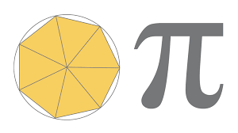
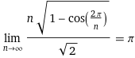

# Archimedes' Approximation of π 

 

The method of Archimedes involves approximating pi by the perimeters of polygons inscribed and circumscribed about a given circle. Rather than trying to measure the polygons one at a time, Archimedes uses a theorem of Euclid to develop a numerical procedure for calculating the perimeter of a circumscribing polygon of 2n sides, once the perimeter of the polygon of n sides is known. Then, beginning with a circumscribing hexagon, he uses his formula to calculate the perimeters of circumscribing polygons of 12, 24, 48, and finally 96 sides. He then repeats the process using inscribing polygons.

The formula I derived using this method _(2π=360o)_

∞) (n sqrt(1 - cos((2 π)/n)))/sqrt(2) = π" width=50%>

This can be confirmed at [Wolfram Alpha](https://www.wolframalpha.com/input/?i=lim_%28n-%3E%E2%88%9E%29+%28n+sqrt%281+-+cos%28%282+%CF%80%29%2Fn%29%29%29%2Fsqrt%282%29).